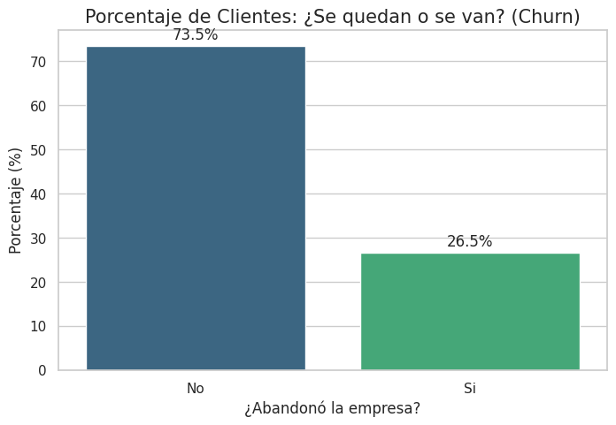
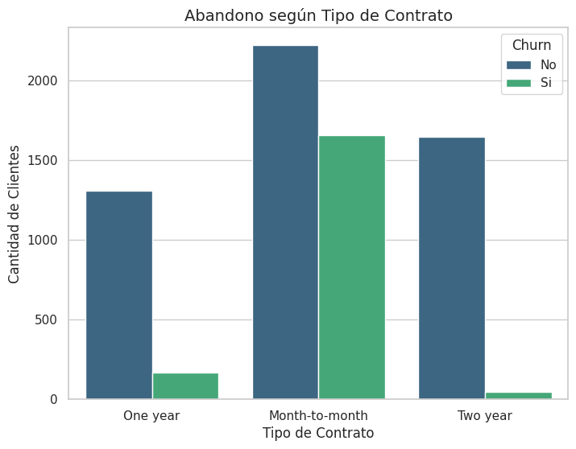
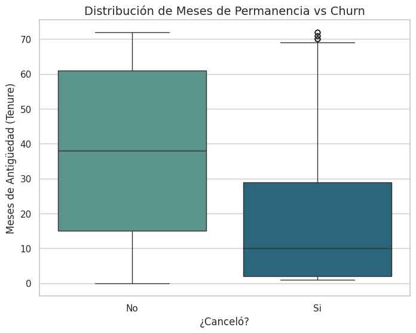
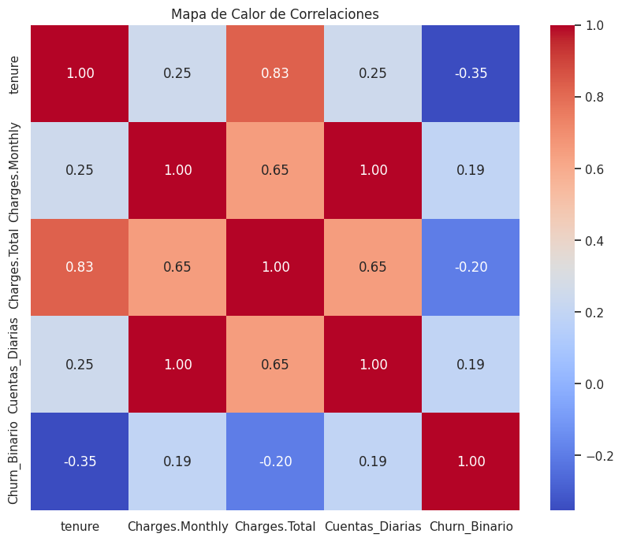

# 📊 Análisis de Evasión de Clientes - Telecom X

Este proyecto realiza un análisis exploratorio de datos (EDA) profundo sobre la evasión de clientes (*churn*) en la empresa **Telecom X**. A través de la ciencia de datos, identificamos patrones críticos y factores de riesgo para proponer estrategias de retención efectivas dentro del marco del programa **Oracle Next Education (#ONE)** de **Alura Latam**.

---
---

## 📍 Índice
1. [Objetivo del Proyecto](#-objetivo-del-proyecto)
2. [Herramientas y Tecnologías](#-herramientas-y-tecnologías)
3. [Proceso de Datos (Pipeline)](#️-proceso-de-datos-pipeline)
4. [Modelado Predictivo (Machine Learning)](Modelado-Predictivo-(Machine-Learning))
5. [Hallazgos Clave](#-hallazgos-clave)
7. [Conclusiones e Informe de Estrategia Final](#-Conclusiones-e-Informe-de-Estrategia-Final) 
8. [Autor](#-autor)

  
## 🚀 Objetivo del Proyecto

Telecom X busca reducir su tasa de cancelación. Este análisis se enfoca en:
* **Normalizar** datos complejos provenientes de estructuras JSON.
* **Identificar** perfiles de clientes con alta probabilidad de abandono.
* **Cuantificar** el impacto financiero mediante nuevas métricas como `Cuentas_Diarias`.
* **Visualizar** relaciones clave entre el tipo de contrato, cargos mensuales y la permanencia del cliente.

## 🧰 Herramientas y Tecnologías

* **Python 3**
* **Pandas** – Limpieza y normalización de datos.
* **NumPy** – Procesamiento numérico.
* **Seaborn & Matplotlib** – Visualización estadística avanzada.
* **Google Colab** – Entorno de desarrollo en la nube.
* **Scikit-Learn** – Creación, entrenamiento y evaluación de modelos predictivos.

## 🛠️ Proceso de Datos (Pipeline)

A diferencia de análisis convencionales, este proyecto puso especial énfasis en la calidad de la información:
1. **Extracción y Normalización:** Desglose de 4 columnas JSON en 22 variables independientes.
2. **Limpieza Rigurosa:** Identificación y eliminación de **224 registros nulos** en la variable objetivo.
3. **Corrección de Tipos:** Transformación de datos financieros de texto a numérico (`Charges.Total`).
4. **Ingeniería de Variables:** Creación de la métrica `Cuentas_Diarias` para análisis granular de facturación.

## 🤖 Modelado Predictivo (Machine Learning)

En la segunda fase del proyecto, implementamos modelos de aprendizaje supervisado para predecir la probabilidad de fuga:

 - **Preparación Avanzada:** Aplicamos <StandardScaler> para normalizar variables numéricas y <get_dummies> para codificar variables categóricas.

 - **División de Datos:** Separación en conjuntos de **Entrenamiento (70%)** y **Prueba (30%)** para garantizar la validez del modelo.

 - **Algoritmos Implementados:**

      - **Regresión Logística:** Modelo lineal robusto para clasificación binaria.
      - **Árbol de Decisión:** Modelo interpretable para identificar las reglas de negocio que llevan a la cancelación.

 - **Métricas de Evaluación:** Análisis exhaustivo mediante **Matriz de Confusión**, Precision, Recall y F1-Score.

---
### **Resultados de los Modelos (Matrices de Confusión)**

[!Regresión Logística](Imágenes/regresion_logistica.png)

[!Árbol de Decisión](Imágenes/arboldedecision.png)

### Análisis de Importancia de Variables
Para entender qué motiva la cancelación, visualizamos los factores con mayor peso en nuestras predicciones:

---
## 📈 Hallazgos Clave

A través del análisis visual y estadístico, identificamos los siguientes puntos críticos:

### 1. Magnitud de la Evasión

* **Tasa de Churn Real:** Tras la limpieza y curaduría de datos, se determinó una evasión del **26.5%**. Este valor representa el punto de partida para las estrategias de retención.

### 2. Segmentación por Contrato y Pago

* **Factor Contractual:** Los clientes con contratos **mes a mes** son el principal detonante de fuga.
* **Método de Pago:** Se detectó una correlación alta de abandono en usuarios que utilizan *Electronic Check*.

### 3. Comportamiento y Lealtad (Tenure)

* **Punto de Lealtad:** La probabilidad de abandono disminuye drásticamente después de los **12 meses** de antigüedad (*tenure*). Los primeros meses son el periodo de mayor riesgo.

### 4. Análisis de Costos y Correlación

* **Impacto de Costos:** Los clientes que cancelan pagan, en promedio, cargos mensuales superiores a los que permanecen, lo que sugiere una sensibilidad al precio.
* **Correlación:** El análisis matemático confirma que la **antigüedad** y los **cargos mensuales** son los principales predictores del comportamiento del cliente.

## 📝 Conclusiones e Informe de Estrategia Final
Tras el análisis exploratorio y la validación con modelos de Machine Learning, hemos definido la siguiente estrategia de negocio:

  **1. Factores Críticos de Fuga** 🚩
  
   - **El Contrato y la Antigüedad:** El tipo de Contrato (Mes a Mes) y la Antigüedad (Tenure) resultaron ser los predictores más fuertes del Churn. El riesgo es máximo   durante los primeros 6 meses de servicio.

   - **Desempeño del Modelo:** Se recomienda el uso de la Regresión Logística, ya que logró un equilibrio óptimo entre detectar fugas reales y evitar falsas alarmas.

  **2. Estrategias de Retención Propuestas**💡
  
   - **Fidelización Temprana (Programa "Early Bird"):** Implementar campañas de bienvenida y acompañamiento intensivo durante los primeros 3 a 6 meses, que es el periodo de mayor vulnerabilidad.

   - **Migración de Contratos:** Ofrecer incentivos y descuentos exclusivos para que los clientes migren de contratos mensuales a planes anuales o bianuales.

   - **Venta Cruzada de "Anclaje":** Promover activamente servicios como Tech Support y Online Security. Los datos demuestran que estos servicios funcionan como "anclas" que aumentan significativamente la permanencia.
          

## 🧑‍💻 Autor

### **Made by:Ivana Papaño**

*Aspirante a Analista de Datos | Alumno en el programa ONE (Oracle + Alura Latam)*

 
 

---
---

